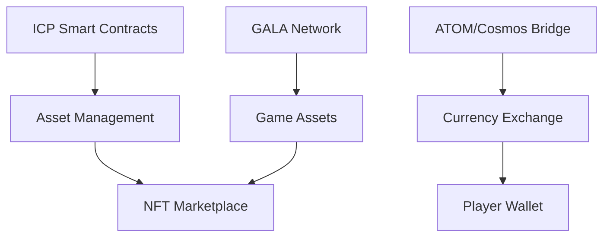

# Blockchain Integration Architecture

#tech #concept #blockchain

## Overview
Multi-chain integration architecture supporting NFT assets, developer marketplace, and player economy.

## Blockchain Infrastructure

### Primary Chains
1. **Internet Computer Protocol (ICP)**
   - Smart contract deployment
   - Developer tools hosting
   - AI service integration
   - Asset storage and delivery

2. **ATOM/Cosmos**
   - Cross-chain interoperability
   - Token bridge infrastructure
   - Inter-blockchain communication
   - Transaction validation

3. **GALA Network**
   - Gaming-specific features
   - NFT marketplace integration
   - Player rewards system
   - Asset ownership tracking

## Technical Components

### Cross-Chain Architecture

### Smart Contract Structure
- Asset minting and verification
- Ownership tracking
- Revenue distribution
- Voting mechanisms
- Market operations

## Developer Integration

### Tools and Services
1. **Asset Creation Pipeline**
   - AI-assisted development tools
   - Asset validation system
   - Metadata generation
   - Smart contract integration

2. **Revenue System**
   - Automated payment distribution
   - Usage tracking
   - Royalty calculations
   - Performance analytics

3. **Marketplace Integration**
   - Asset listing
   - Community voting
   - Price discovery
   - Trading mechanisms

## Player Economy

### Currency System
- In-game token economics
- Cross-chain exchange
- Reward distribution
- Survey completion tracking

### Asset Management
- Player inventory system
- Trading platform
- Seasonal item management
- Collection tracking

## Security Considerations

### Smart Contract Security
- Audit requirements
- Update mechanisms
- Access control
- Emergency procedures

### Transaction Security
- Multi-sig requirements
- Rate limiting
- Fraud prevention
- Dispute resolution

## Performance Requirements

### Transaction Processing
- Maximum latency: 2s
- Minimum TPS: 1000
- Cost per transaction target
- Scalability metrics

### Asset Delivery
- Maximum load time: 1s
- CDN integration
- Caching strategy
- Bandwidth optimization

## Future Considerations
- Layer 2 scaling solutions
- Additional chain integrations
- Governance evolution
- Economic model adjustments 