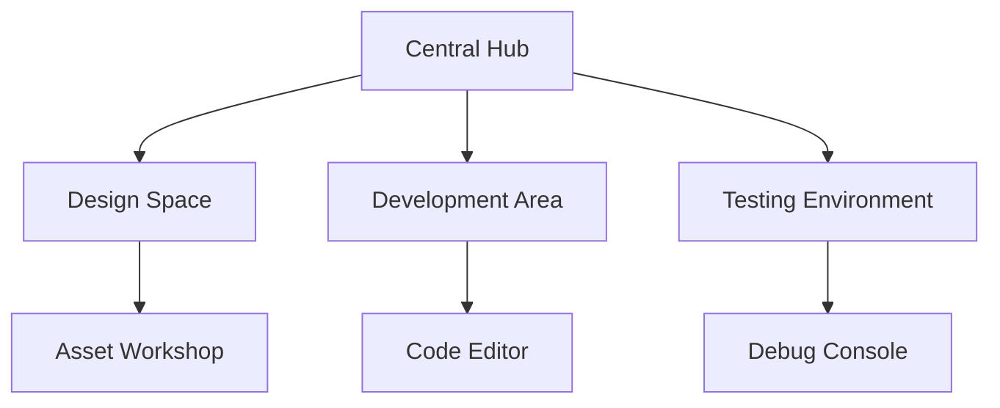

# AI Agent Collaboration System

#mechanic #tech #ai

## Overview
A virtual environment where AI agents collaborate on game development tasks through a visual interface, inspired by ChatDev and modern multi-agent systems.

## Core Components

### Agent Roles
1. **Development Team**
   - Project Manager
   - Game Designer
   - Programmer
   - Artist
   - QA Tester
   - Documentation Specialist

2. **Specialized Agents**
   - Asset Creation Agent
   - Code Review Agent
   - Performance Optimization Agent
   - Bug Detection Agent
   - Content Generation Agent

### Visual Interface

#### Workspace Visualization


#### Agent Interaction System
- Real-time agent communication
- Visual task tracking
- Progress visualization
- Resource management
- Version control integration

## Collaboration Mechanics

### Task Management
1. **Project Planning**
   - Task breakdown
   - Resource allocation
   - Timeline management
   - Priority setting
   - Dependency tracking

2. **Workflow Automation**
   - CI/CD integration
   - Automated testing
   - Code generation
   - Asset optimization
   - Documentation generation

### Communication System
- Inter-agent messaging
- Visual feedback loops
- Decision trees
- Progress tracking
- Error reporting

## Technical Implementation

### AI Integration
1. **Model Integration**
   - GPT-4 for general tasks
   - Specialized models for specific roles
   - Multi-model orchestration
   - Context management
   - Performance optimization

2. **Agent Memory**
   - Short-term task memory
   - Long-term project knowledge
   - Cross-agent knowledge sharing
   - Context preservation
   - Learning from interactions

### Development Environment
```json
{
  "workspace": {
    "visualEditor": {
      "components": ["2D", "UI", "Logic"],
      "tools": ["Draw", "Script", "Test"]
    },
    "codeEditor": {
      "languages": ["JavaScript", "TypeScript"],
      "features": ["AutoComplete", "Debug", "Preview"]
    },
    "assetManager": {
      "types": ["Sprites", "Audio", "Scripts"],
      "tools": ["Import", "Edit", "Organize"]
    }
  }
}
```

## User Interaction

### Developer Tools
- Visual programming interface
- Asset creation tools
- Testing framework
- Debug console
- Performance profiler

### Control Mechanisms
- Agent task assignment
- Priority management
- Resource allocation
- Quality control
- Progress monitoring

## Integration Features

### Version Control
- Git integration
- Change tracking
- Branch management
- Merge handling
- Conflict resolution

### Asset Pipeline
- Asset creation workflow
- Optimization process
- Quality assurance
- Distribution system
- Update management

## Future Enhancements

### Planned Features
- Enhanced AI models
- Advanced visualization
- Real-time collaboration
- Community features
- Extended tool integration

### Research Areas
- Agent learning systems
- Improved coordination
- Performance optimization
- Security enhancements
- User experience refinement 