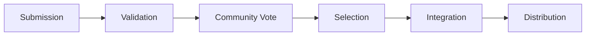

# Developer Marketplace & Content Creation System

#mechanic #blockchain #tech

## Overview
A blockchain-powered marketplace enabling developers to create, submit, and monetize game content using AI-assisted tools.

## Core Features

### Content Creation System
1. **Asset Types**
   - Visual assets (characters, items, effects)
   - Game mechanics and functions
   - Environmental elements
   - Sound effects and music
   - Seasonal/special events

2. **AI-Assisted Development Tools**
   - Asset generation assistance
   - Code generation helpers
   - Testing automation
   - Quality assurance tools
   - Performance optimization

3. **Submission System**
   - Asset validation pipeline
   - Technical requirements checking
   - Community preview system
   - Version management
   - Documentation generation

## Marketplace Mechanics

### Weekly Release Cycle


### Voting System
- Community voting mechanics
- Developer reputation system
- Quality metrics
- Popularity tracking
- Historical performance

### Revenue Model
1. **Initial Sale**
   - Primary market pricing
   - Launch bonuses
   - Early adopter rewards
   - Marketing support

2. **Recurring Revenue**
   - Usage-based royalties
   - Secondary market fees
   - Integration bonuses
   - Performance incentives

## Technical Implementation

### Smart Contract Architecture
```json
{
  "assetContract": {
    "metadata": {
      "creator": "address",
      "assetType": "string",
      "version": "string",
      "dependencies": []
    },
    "revenue": {
      "primarySale": "uint",
      "royaltyPercentage": "uint",
      "distributionRules": {}
    },
    "governance": {
      "votingPeriod": "uint",
      "approvalThreshold": "uint",
      "stakeholders": []
    }
  }
}
```

### Integration Pipeline
1. **Submission Phase**
   - Asset upload
   - Metadata creation
   - Technical validation
   - Documentation review

2. **Review Phase**
   - Community voting
   - Technical review
   - Performance testing
   - Security audit

3. **Integration Phase**
   - Smart contract deployment
   - Asset distribution
   - System integration
   - Market activation

## Developer Tools

### Creation Suite
- Visual asset editor
- Code generation tools
- Testing framework
- Documentation generator
- Performance analyzer

### Analytics Dashboard
- Sales tracking
- Usage metrics
- Revenue analytics
- Performance stats
- Community feedback

## Community Features

### Interaction Systems
- Developer forums
- Feature requests
- Bug reporting
- Collaboration tools
- Knowledge base

### Reputation System
- Quality scores
- Success metrics
- Community standing
- Collaboration rating
- Historical performance

## Future Roadmap
- Advanced AI tools integration
- Cross-platform expansion
- Additional asset types
- Enhanced analytics
- Automated testing systems 