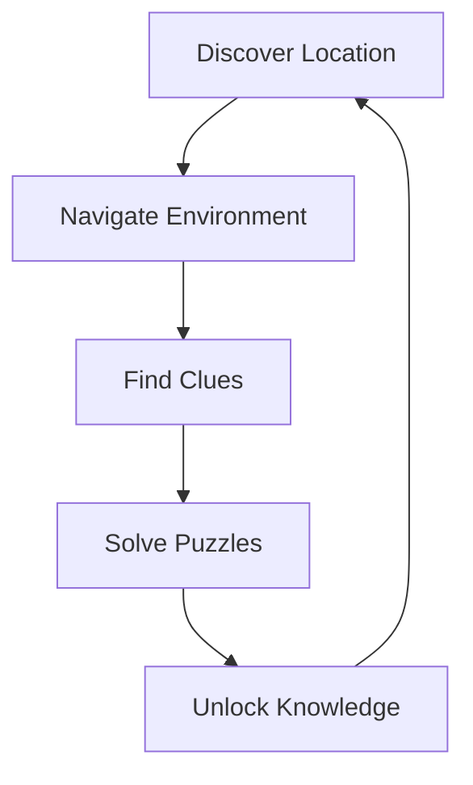
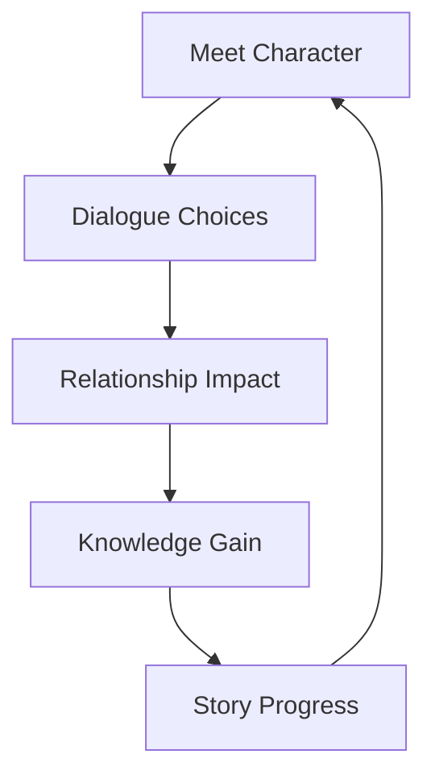

# Narrative-Driven Gameplay Systems

#mechanic #narrative #gameplay

## Core Gameplay Loops

### Exploration Loop

### Character Interaction Loop

## Key Gameplay Systems

### Knowledge System
1. **Discovery Mechanics**
   - Document collection
   - Artifact examination
   - Environmental observation
   - NPC conversations
   - Puzzle solutions

2. **Knowledge Repository**
   - Journal system
   - Map annotations
   - Character profiles
   - Cultural records
   - Scientific observations

### Puzzle Mechanics

#### Veil Puzzles
- Astronomical alignments
- Ancient machinery
- Element manipulation
- Symbol interpretation
- Physical mechanisms

#### Cultural Puzzles
- Ritual recreation
- Language translation
- Traditional practices
- Social customs
- Historical events

### Character Interaction

#### Dialogue System
- Multiple choice responses
- Reputation tracking
- Knowledge-based options
- Cultural sensitivity
- Hidden intentions

#### Relationship Management
- Trust building
- Favor system
- Alliance formation
- Reputation effects
- Cultural standing

## World Interaction

### Environmental Systems
1. **Navigation**
   - Map system
   - Landmark identification
   - Trail marking
   - Fast travel points
   - Region unlocking

2. **Time System**
   - Day/night cycle
   - Celestial events
   - Cultural ceremonies
   - Weather patterns
   - Seasonal changes

### Cultural Integration

#### Community Interaction
- Local customs
- Trade systems
- Social hierarchies
- Cultural festivals
- Political dynamics

#### Knowledge Exchange
- Teaching mechanics
- Learning systems
- Skill development
- Cultural exchange
- Information sharing

## Progress Systems

### Character Development
1. **Skills**
   - Research abilities
   - Cultural understanding
   - Physical capabilities
   - Social interaction
   - Puzzle solving

2. **Equipment**
   - Research tools
   - Navigation aids
   - Cultural artifacts
   - Ancient technology
   - Protective items

### Story Progression

#### Achievement System
- Discovery milestones
- Cultural understanding
- Puzzle completion
- Relationship building
- Knowledge gathering

#### Choice Impact
- Story branching
- Character reactions
- World changes
- Cultural shifts
- Personal growth

## Technical Implementation

### AI Integration
1. **NPC Behavior**
   - Dynamic responses
   - Memory of interactions
   - Cultural authenticity
   - Adaptive dialogue
   - Emotional reactions

2. **World Events**
   - Dynamic weather
   - Cultural celebrations
   - Random encounters
   - Environmental changes
   - Story triggers

### Save System
- Progress tracking
- Choice recording
- Relationship states
- World state
- Achievement data

## Future Features

### Planned Additions
- New puzzle types
- Extended dialogue systems
- Additional cultures
- Expanded locations
- Advanced AI interactions

### Community Features
- Shared discoveries
- Cultural exchanges
- Puzzle solutions
- Story experiences
- Achievement sharing 