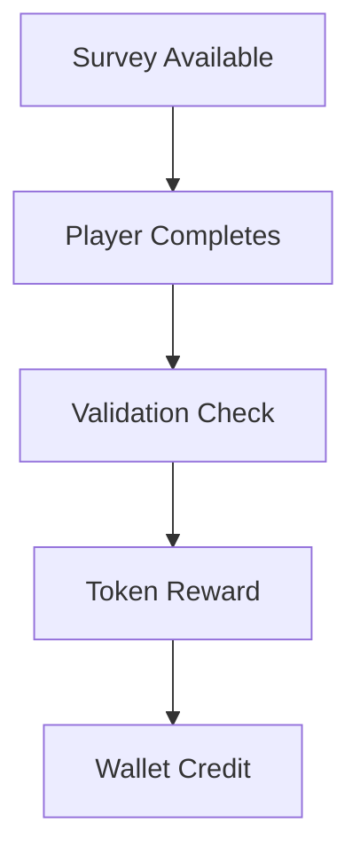

# Player Economy and Rewards System

#mechanic #blockchain #economy

## Overview
A blockchain-based economy system enabling players to earn, trade, and participate in the game's marketplace through various activities.

## Currency System

### Token Economics
1. **In-Game Currency**
   - Cross-chain token integration
   - Exchange mechanisms
   - Value stability measures
   - Transaction fees

2. **Earning Mechanisms**
   - Survey completion rewards
   - Daily activity bonuses
   - Achievement rewards
   - Community participation
   - Special event earnings

### Survey System


## Trading System

### Player Marketplace
1. **Asset Trading**
   - Direct player-to-player trading
   - Auction house system
   - Price discovery mechanism
   - Trading history tracking

2. **Seasonal Items**
   - Limited time availability
   - Rarity tiers
   - Collection bonuses
   - Trading restrictions

### Smart Contract Implementation
```json
{
  "tradeContract": {
    "trade": {
      "seller": "address",
      "buyer": "address",
      "item": "itemId",
      "price": "uint",
      "expiry": "timestamp"
    },
    "validation": {
      "itemStatus": "bool",
      "tradeRestrictions": [],
      "fees": "uint"
    }
  }
}
```

## Collection System

### Asset Categories
- Equipment and items
- Cosmetic elements
- Special editions
- Event memorabilia
- Achievement tokens

### Collection Mechanics
- Set completion bonuses
- Rarity tracking
- Display features
- Trading incentives
- Historical value tracking

## Economic Controls

### Market Stability
- Price floors and ceilings
- Transaction rate limits
- Anti-manipulation measures
- Value preservation mechanisms

### Security Features
- Trade escrow system
- Dispute resolution
- Fraud prevention
- Account recovery

## Community Features

### Social Trading
- Friend trading bonuses
- Group trading pools
- Community markets
- Trading reputation

### Economic Participation
- Market making rewards
- Liquidity provision
- Community governance
- Economic proposals

## Technical Requirements

### Performance Metrics
- Maximum trade delay: 5s
- Minimum daily transactions
- Price update frequency
- System availability

### Security Measures
- Multi-signature trades
- Time-locked transactions
- Value verification
- Automated monitoring

## Future Expansion
- Additional earning methods
- New collection types
- Enhanced trading features
- Market analysis tools
- Community governance expansion 