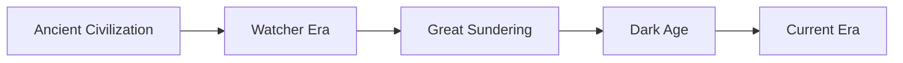
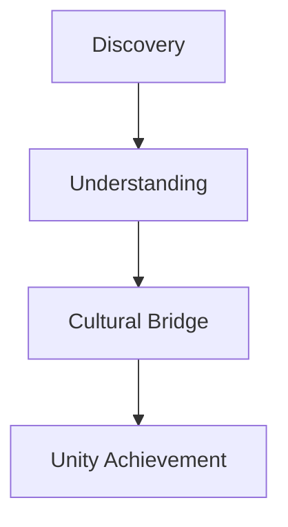
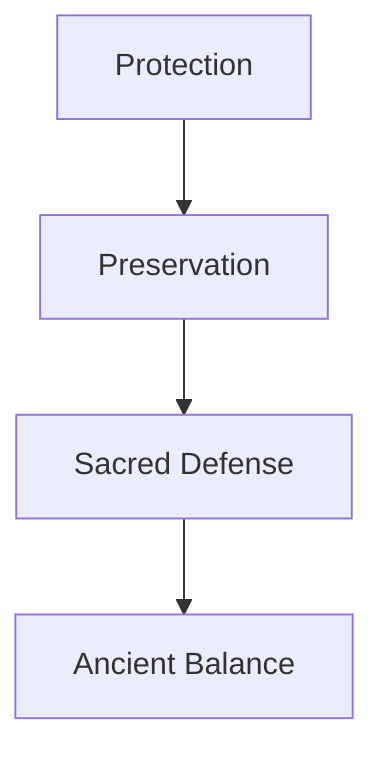
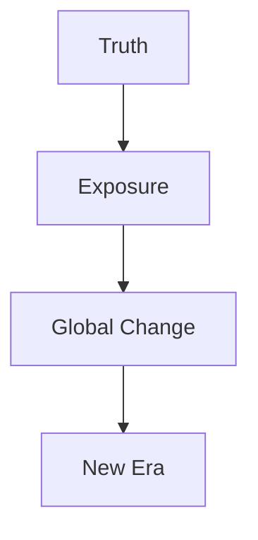

# Chronicles of the Ancients - Story Bible

#narrative #concept #worldbuilding

## World Overview

### The World of Atheron
- Ancient advanced civilization
- Mystical connection to celestial beings
- Post-Great Sundering era
- Sacred sites called "The Veils"
- Diverse landscapes and cultures

### Historical Timeline

## Core Narrative Elements

### The Great Sundering
- Catastrophic historical event
- Scattered celestial knowledge
- Broken connection with Watchers
- Cultural fragmentation
- Lost technologies

### The Veils
- Sacred connection points
- Celestial-earthly bridges
- Ancient power sources
- Hidden knowledge repositories
- Astronomical alignments

## Key Characters

### The Protagonist
- Background: Scholar turned explorer
- Motivation: Knowledge and truth
- Skills: Research and exploration
- Character Arc: From academic to cosmic truth-seeker
- Personal Stakes: Understanding universal truths

### The Guardian
- Role: Ancient protector
- Nature: Mysterious and cryptic
- Purpose: Test and guide worthy seekers
- Powers: Unknown extent
- Moral Alignment: Neutral/Good

### The Historian
- Role: Mentor figure
- Knowledge Base: Ancient texts and myths
- Relationship: Guide to protagonist
- Philosophy: Past shapes future
- Story Function: Knowledge provider

### The Adversary
- Motivation: Power and control
- Methods: Manipulation and force
- Resources: Political and material
- Goal: Exploit Veil power
- Threat Level: Global impact

## Story Paths

### Path of Insight

### Path of Restoration

### Path of Revelation

## World Cultures

### Eastern Regions
- Desert civilizations
- Ancient ruins
- Nomadic traditions
- Celestial observation
- Oral histories

### Western Valleys
- Settled communities
- Agricultural societies
- Written records
- Sacred groves
- Mystical traditions

## Narrative Themes

### Major Themes
- Knowledge vs. wisdom
- Progress vs. preservation
- Individual vs. collective good
- Ancient wisdom in modern times
- Power and responsibility

### Philosophical Questions
- Role of knowledge in society
- Balance of progress and tradition
- Responsibility of discovery
- Truth's impact on society
- Individual choice vs collective good

## Story Structure

### Act 1: Discovery
- Library discovery
- Initial journey
- First Veil encounter
- Meeting the Guardian
- Understanding the mission

### Act 2: Journey
- Multiple Veil explorations
- Cultural interactions
- Adversary confrontations
- Knowledge gathering
- Personal growth

### Act 3: Revelation
- Final Veil activation
- Ultimate truth revealed
- Major choice
- World-changing decision
- Personal resolution

## Integration Points

### Gameplay Connection
- Exploration mechanics reflect story
- Dialogue choices impact narrative
- Puzzle design ties to lore
- Cultural interaction systems
- Choice-based progression

### Environmental Storytelling
- Architectural details
- Cultural artifacts
- Natural formations
- Ancient technology
- Hidden symbols

## Future Expansion Possibilities

### Potential DLC Stories
- Pre-Sundering tales
- Watcher origins
- Guardian backgrounds
- Cultural deep dives
- Alternative timelines

### Narrative Hooks
- Unexplored regions
- Ancient technologies
- Lost civilizations
- Celestial mysteries
- Cultural conflicts 