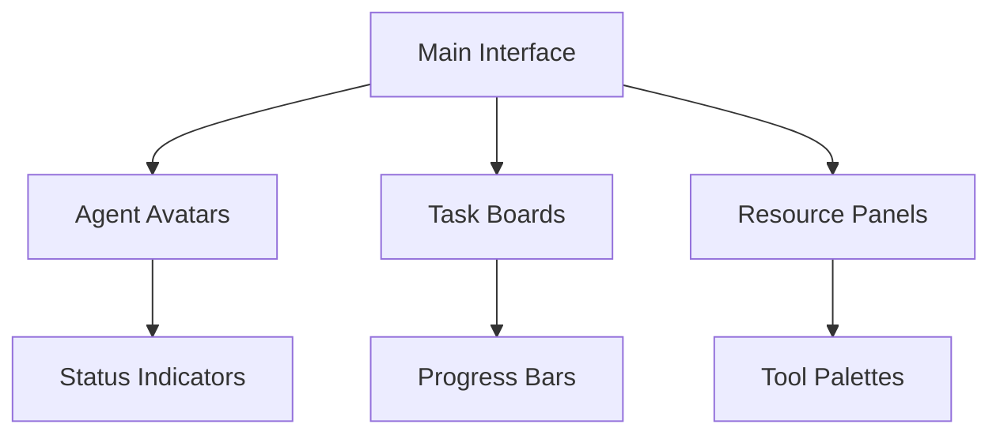

# AI Agent Visual Interface Design

#visual #ui #interaction

## Overview
A game-like interface for visualizing and interacting with AI agents in a collaborative development environment.

## Visual Style

### Interface Theme
1. **Design Philosophy**
   - Clean and minimalist
   - Game-inspired elements
   - Clear visual hierarchy
   - Intuitive navigation
   - Responsive design

2. **Color Scheme**
   - Primary: Professional blues
   - Secondary: Accent colors for agents
   - Status indicators
   - Progress highlights
   - Alert colors

### Visual Elements

## Game-Like Features

### Agent Visualization
1. **Agent Avatars**
   - Unique character designs
   - Role-specific appearances
   - Status animations
   - Activity indicators
   - Interaction cues

2. **Environment Design**
   - Virtual workspace
   - Tool stations
   - Meeting areas
   - Resource centers
   - Progress tracking zones

### Interactive Elements

#### Task Management
- Drag-and-drop assignments
- Interactive kanban boards
- Resource allocation maps
- Timeline visualizations
- Dependency networks

#### Communication
- Chat bubbles
- Thought processes
- Decision trees
- Collaboration paths
- Status updates

## User Experience

### Navigation System
1. **Workspace Areas**
   - Central hub
   - Development zones
   - Testing areas
   - Resource centers
   - Communication spaces

2. **Tool Access**
   - Quick access toolbar
   - Context-sensitive menus
   - Shortcut systems
   - Tool combinations
   - Custom layouts

### Interaction Models

#### Direct Manipulation
- Drag-and-drop interface
- Click-and-drag selection
- Pinch-to-zoom
- Pan navigation
- Context menus

#### Feedback Systems
- Visual responses
- Audio cues
- Haptic feedback
- Progress indicators
- Status notifications

## Animation System

### Agent Animations
1. **State Changes**
   - Idle animations
   - Working states
   - Communication poses
   - Transition effects
   - Celebration animations

2. **Interaction Feedback**
   - Selection highlights
   - Action confirmations
   - Error indicators
   - Progress effects
   - Success celebrations

### Environmental Effects
- Ambient movements
- Resource flows
- Progress particles
- Status indicators
- System notifications

## Accessibility Features

### Visual Aids
- High contrast mode
- Color blind options
- Text scaling
- Icon alternatives
- Motion reduction

### Interface Customization
- Layout options
- Color schemes
- Text size
- Animation control
- Sound settings

## Technical Requirements

### Performance Targets
- 60 FPS minimum
- Smooth animations
- Quick response time
- Efficient rendering
- Memory optimization

### Scalability
- Multiple agents
- Large projects
- Complex visualizations
- Resource management
- Data handling

## Future Enhancements

### Planned Features
- 3D visualization
- VR/AR support
- Advanced animations
- Customization options
- Performance improvements

### Research Areas
- User interaction patterns
- Visual feedback systems
- Accessibility improvements
- Performance optimization
- Interface innovations 